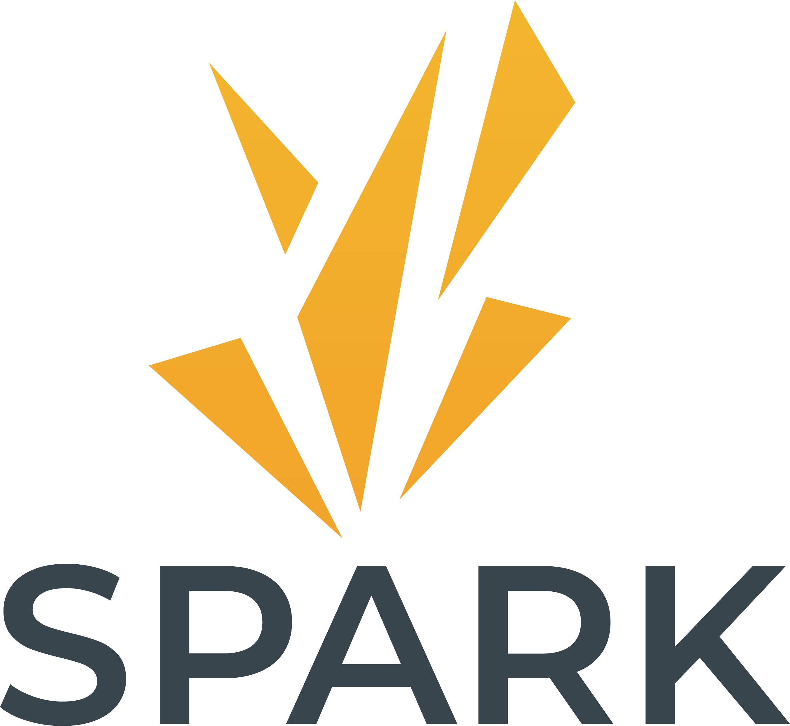

# Spark Document Hub

**Spark Protocol** is a front-end for interacting with DAI. At launch, the first offering will be **Spark Lend (SL)**, a lending market focused on the most liquid, decentralized, and highest market cap assets. Currently planned future releases will include resilient oracles and fixed rates.

